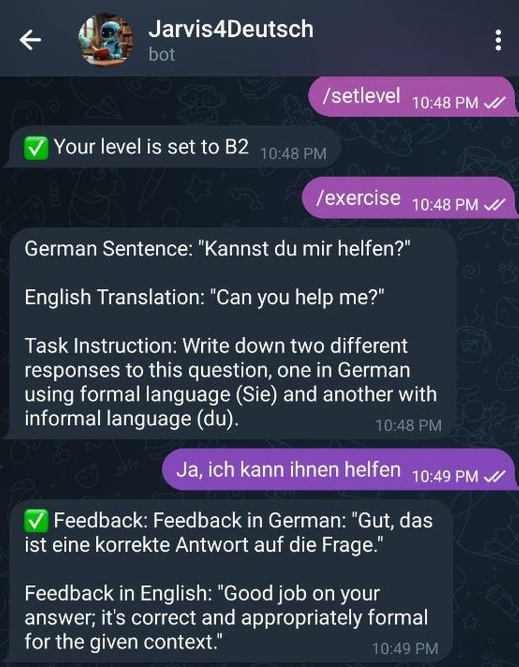

# German Learning Chatbot

This is a Telegram bot designed to help you **learn German** interactively. The bot uses a local LLaMA-based model (`phi3`) via LangChain, and can be extended to support **RAG (Retrieval-Augmented Generation)** for contextual responses.

## Sample Chat with the Bot



## Features

- Interactive German conversation practice.
- Understands general text input (not just predefined commands).
- Modular architecture: separates Telegram bot logic, model interaction, and utilities.
- Future-ready for NLP enhancements and multi-model support.

## Requirements

- Docker & Docker Compose
- Telegram bot token from [BotFather](https://t.me/BotFather)


## Setup

1. Create a `.env` file in the project root with your Telegram bot token:

```env
TELEGRAM_TOKEN=your_bot_token_here

## Build and run the bot using Docker Compose:
docker-compose up --build

# Stop the bot 
docker-compose down

## Project Structure

data_rag/
src/
|── llm/              # Model interaction & utilities
├── prompts/          # Prompts for the LLM
├── bot_handlers.py   # Telegram bot commands and message handling
├── main.py           # Entry point
start.sh              # Starts Ollama and the bot
Dockerfile            # Container setup
docker-compose.yml    # Service orchestration


